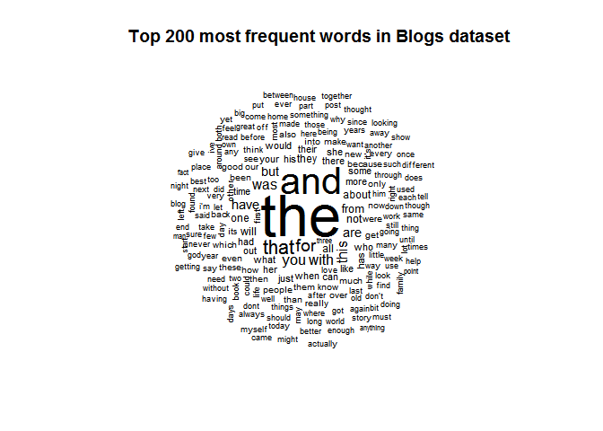
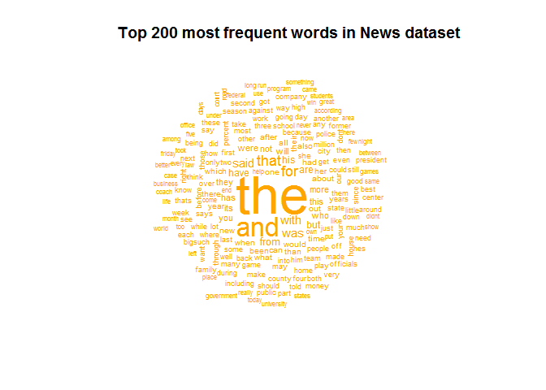
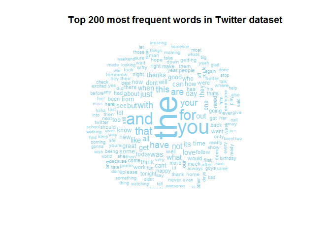
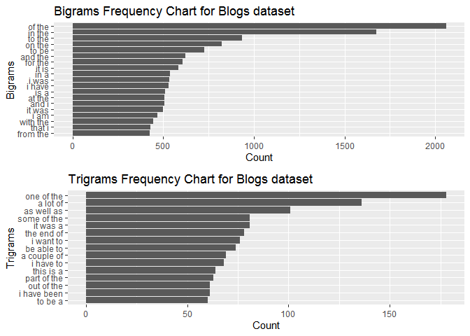
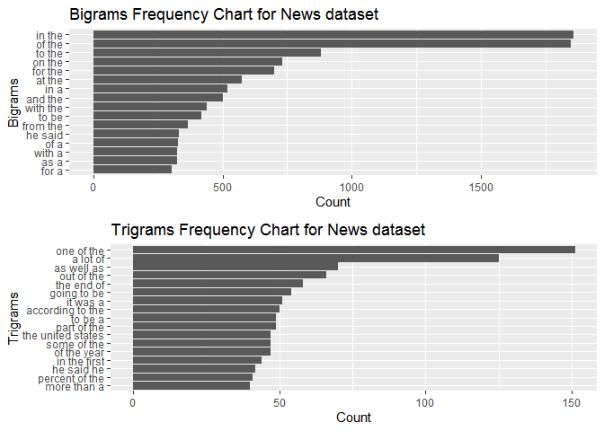
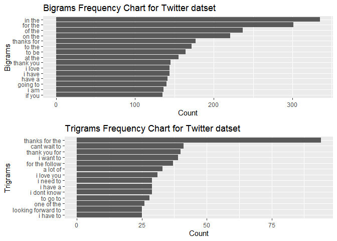

### 1. Introduction:

This is a milestone report for the 'Data Science Capstone' course offered by John Hopkins University through Coursera. The goal of the project is to build a Predictive Text Model App.

As a first step in building the App, we need to source a Natural Language dataset. The datasets have been provided by the course itself, which in turn has sourced the dataset from SwiftKey. In this report we have conducted Exploratory Data Analysis (EDA) of the dataset. The dataset comprises of data from three sources viz. blogs, news and twitter in four different languages viz. English, German, Finnish and Russian. We will use the English dataset for building our App.
<br />

### 2. Load Libraries:

The requisite libraries for our EDA are loaded as under:


```r
library(stringi); library(tm); library(wordcloud); library(RWeka) 
library(ggplot2); library(gridExtra)
```
<br />

### 3. Load dataset:

The dataset has been loaded as under:


```r
url <- 'https://d396qusza40orc.cloudfront.net/dsscapstone/dataset/Coursera-SwiftKey.zip'
destination <- '.\\Project_Data.zip'

if(!file.exists(destination)){
        download.file(url=url, destfile=destination, method='curl')
        unzip(zipfile=destination, exdir='.')    
    }


file_blogs <- file(".\\final\\en_US\\en_US.blogs.txt")
data_blogs <- readLines(file_blogs,encoding = "UTF-8",skipNul = TRUE)
close(file_blogs)

file_news <- file(".\\final\\en_US\\en_US.news.txt", 'rb')
data_news <- readLines(file_news,encoding = "UTF-8",skipNul = TRUE)
close(file_news)

file_twitter <- file(".\\final\\en_US\\en_US.twitter.txt")
data_twitter <- readLines(file_twitter,encoding = "UTF-8",skipNul = TRUE)
close(file_twitter)
```
<br />

### 4. Summary statistics:

We have calculated three kinds of summary statistics viz. `line_count`, `word_count` and `words_per_line`. We can observe and infer the following:

- The twitter dataset has the highest number of lines. However, it has the least number of words and thus the least number of words per line.
- The blogs dataset has on average the longest sentences.
- Blogs and News datasets can help us in predicting text after longer sequence of words.
- Twitter dataset could be more helpful in predicting texts after small and informal sequence of words.
   

```r
## Count lines 
line_count <- c(length(data_blogs),
                 length(data_news),
                 length(data_twitter))

#Count words
word_count <- c(sum(stri_count_words(data_blogs)),
                sum(stri_count_words(data_news)),
                sum(stri_count_words(data_twitter)))

#Display basic table
data_summary <- data.frame(Lines = line_count,
                           Words = word_count, 
                           Words_per_line = word_count/line_count)

row.names(data_summary) <- c('Blogs','News','Twitter')

print(data_summary)
```

```
          Lines    Words Words_per_line
Blogs    899288 37546239       41.75107
News    1010242 34762395       34.40997
Twitter 2360148 30093413       12.75065
```
<br />

### 5. Data Sampling:

The data currently is too volumnious and can not be processed with the available computing resources. Hence, we would sample 10000 rows at random from each of the three datasets.


```r
set.seed(12354)
sample_size <- 10000

sample_blogs <- sample(data_blogs, size=sample_size)
sample_news <- sample(data_news, size=sample_size)
sample_twitter <- sample(data_twitter, size=sample_size)

remove(data_blogs); remove(data_news); remove(data_twitter) # Freeing up memory
```
<br />

### 6. Data Cleaning:

We will be performing the following steps to clean our data:

a) Convert the data to only Ascii characters
b) Creating a corpus of our dataset with the `tm` package
c) Convet all text to lower case
d) Removing profane(banned) words
e) Removing punctuation
f) Removing numbers
g) Removing extra whitespaces
    
Note: The code chunk including the list of `banned_words` is hidden 


```r
cleanData <- function(input_data){
    
    output_data <- iconv(input_data, "UTF-8","ASCii","byte") # Step (a)
    output_data <- VCorpus(VectorSource(input_data)) # Step (b)
    output_data <- tm_map(output_data, content_transformer(tolower)) # Step (c)
    output_data <- tm_map(output_data, removeWords, banned_words) # Step (d)
    output_data <- tm_map(output_data,removePunctuation) # Step (e)
    output_data <- tm_map(output_data, removeNumbers) # Step (f)
    tm_map(output_data, stripWhitespace) # Step (g)
}   

clean_blogs <- cleanData(sample_blogs)
clean_news <- cleanData(sample_news)
clean_twitter <- cleanData(sample_twitter)

remove(sample_blogs); remove(sample_news); remove(sample_twitter) # Freeing up memory 
```
<br />

### 7. Word Clouds:

In this section we will analyze the frequency of the most common words and we will plot them as a word cloud for each of the datasets. We can infer the following:

- Determiners, Prepositions, Pronouns and Conjuctions are generally the most common words. These are more generally called as stopwords.
- 'the'and 'you' are most common in all three datasets. However, Twitter dataset has many more stopwords that are quite frequent such as 'have', 'your', 'that' etc. These other stopwords have moderate frequencies realtive to other words in news and blogs datasets.


```r
wordcloud(clean_blogs, max.words = 200, random.order = FALSE, color = "black")
title("Top 200 most frequent words in Blogs dataset")        
```

<!-- -->

```r
wordcloud(clean_news, max.words = 200, random.order = FALSE, color = "orange")
title("Top 200 most frequent words in News dataset")        
```

<!-- -->

```r
wordcloud(clean_twitter, max.words = 200, random.order = FALSE, color = "skyblue")
title("Top 200 most frequent words in Twitter dataset")        
```

<!-- -->
<br />

### 8. N-Gram Analysis:

In this section, we will look at the frequency plots of bigrams and trigrams for the three datasets. The observations and inferences are as follows:

- Bigrams are dominated by the word 'the' 
- Blogs dataset has higher count of bigrams and trigrams followed by news and twitter respectively. This may be due to well formed and structured sentences in blogs.
- Blogs and news datasets have more explantory trigrams like 'one of the' and 'as well as' etc.
- Twitter dataset has more informal trigrams like 'i need to' and 'i love you' etc.
- An interesting trigram in news dataset is 'the united states'. It shows that many of the lines in news talk about the USA and maybe the news articles are primarily drawn from USA news websites.


```r
analyzeNgrams <- function(input_data){
    
    bigram_tokenizer <- function(x) NGramTokenizer(x, Weka_control(min = 2, max = 2))
    trigram_tokenizer <- function(x) NGramTokenizer(x, Weka_control(min = 3, max = 3))

    bigram_tdm <- TermDocumentMatrix(
        input_data, control = list(tokenize = bigram_tokenizer))

    trigram_tdm <- TermDocumentMatrix(
        input_data, control = list(tokenize = trigram_tokenizer))
    
    list(bigram = bigram_tdm, trigram = trigram_tdm)
}

plotNgrams <- function(bigram_tdm, trigram_tdm, bigramLow, trigramLow, title){
    
    bigrams = findFreqTerms(bigram_tdm, lowfreq = bigramLow)
    bigrams_count = rowSums(as.matrix(bigram_tdm[bigrams,]))
    data_bigram = data.frame(Words=bigrams, Count=bigrams_count)
    
    trigrams = findFreqTerms(trigram_tdm, lowfreq = trigramLow)
    trigrams_count = rowSums(as.matrix(trigram_tdm[trigrams,]))
    data_trigram = data.frame(Words=trigrams, Count=trigrams_count)
    
    g1 <- ggplot(data_bigram, aes(x=reorder(Words, Count), y=Count)) +
        geom_col() +  coord_flip() +
        xlab("Bigrams") + ylab("Count") +
        labs(title = paste("Bigrams Frequency Chart for", title))
    
    g2 <- ggplot(data_trigram, aes(x=reorder(Words, Count), y=Count)) +
        geom_col() +  coord_flip() +
        xlab("Trigrams") + ylab("Count") +
        labs(title = paste("Trigrams Frequency Chart for", title))
    
    grid.arrange(g1, g2)
}

tdm_blogs <- analyzeNgrams(clean_blogs)
plotNgrams(tdm_blogs$bigram, tdm_blogs$trigram, 400, 60, 'Blogs dataset')
```

<!-- -->

```r
tdm_news <- analyzeNgrams(clean_news)
plotNgrams(tdm_news$bigram, tdm_news$trigram, 300, 40, 'News dataset')
```

<!-- -->

```r
tdm_twitter <- analyzeNgrams(clean_twitter)
plotNgrams(tdm_twitter$bigram, tdm_twitter$trigram, 130, 25, 'Twitter datset')
```

<!-- -->
<br />

### 9. Conclusion:

The analysis above has served us well in providing us a future course of action. First, we will combine the three datasets and split this combined dataset into training and testing datasets. Then, we may adopt several of the following approaches:

- TFIDF(term frequency-inverse document frequency) analysis, to reduce the effect of stopwords in our prediction algorithms.
- Build a N-gram model or a backoff N-gram model.
- Build bag-of-words model and determine word embeddings.
    
The exact choice of the model will be dependent upon the performance of the models on the testing dataset, speed of the models and computing resources required by the models.
